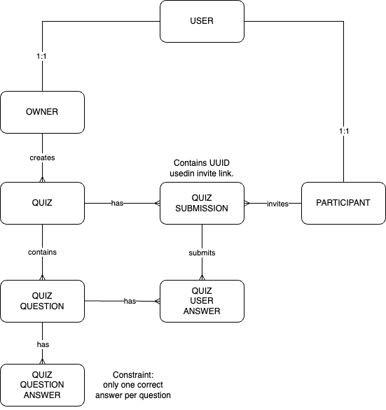

# Scope

Assumptions made about scope.

## Authentication

Since the QAAS is to provide an API, I assume that user authentication will be taken care of by the client using the API. Whether it's a web client or a mobile app, doesn't matter.

At first was tempted to use something like [django-sesame](https://django-sesame.readthedocs.io/en/stable/index.html) for authentication with magic links. But I believe a "skin" for authentication is outside this assignment's scope.

## Email configuration

For emails to actually work, email related settings need to be configured. For this assignment these were not configured. But the code does assume they are.

## Deployment

The only "delivery" requirement is:

> We have to be able to run the result on our laptop

A minimal Dockerfile is provided for this purpose.

## Tests

> We expect you to write five tests on whatever you think is relevant to test

I think if there is reason to write something, then there is enough reason to write a test for it. I'd rather not cover all requirements, but have what is done fully-covered by tests.

## Packages

Alongside Django for a REST API? These two:

* [DRF](https://www.django-rest-framework.org/)
* [django-filter](https://django-filter.readthedocs.io/en/stable/index.html)

# Organising the work for review

To help reviewers go through what has been done, the work was split into different tickets/pull requests:

## Ticket 1

* Initial blank Django project
* Basic Docker configuration
* Since it's a "small web app" I decided to go on with sqlite rather than postgres. For anything "production quality" sqlite is *not* an option.

PR: https://github.com/jvzammit/operqaas/pull/1

## Ticket 2

* Puts `SECRET_KEY` in its own environment variable

PR: https://github.com/jvzammit/operqaas/pull/2

## Ticket 3

Model layer:

* Entity-Relationship Diagram
* Definition of models & managers + unit tests
* Basic admin

PR: https://github.com/jvzammit/operqaas/pull/3

## Ticket 4

* Changes ERD to simplify future work. Adds `Owner` and `Participant` entities, each with a FK to `User` model.

PR: https://github.com/jvzammit/operqaas/pull/4

## Ticket 5

* API views
* Integration tests using DRF test client

PR: https://github.com/jvzammit/operqaas/pull/5

## Ticket 6

* Removed FK from `QuizSubmission` to `Owner`. Because the `QuizOwner` can be retrieved through the `Quiz` model, to which `QuizSubmission` already has a FK.

PR: https://github.com/jvzammit/operqaas/pull/6


# Requirements Delivered

And ~~not delivered~~. Due to time constraint. All delivered requirements are covered by tests.

### Quiz creator
As quiz creator I want to:

* Build a quiz
* Invite participants through e-mail
* Check up on the progress of the quiz
* Check up on the scores of the quiz
* ~~Notify participants of the results through e-mail~~
* Browse quizzes, participants, invitees, answers,... - search, filter,...
* Only see quizzes relevant to me

### Quiz participant

As a quiz participant I want to:

* Accept an invitation
* Participate in the quiz
* Check up on the progress of the quiz Browse my quizzes - search, filter,...
* Only see quizzes relevant to me

### Admin

**Due to time constraints, admin requirements only delivered in part!!*

As an admin I want to:

* Be able to troubleshoot through the admin when users have issues
* Search quizzes, participants, answers,...
* Modify quizzes, participants, answers,...
* Download a daily report on the usage of our QaaS service (CSV/JSON/...)

## A note on tests

One big integration test, _sigh_.

Ideally a better test structure is followed.

The approach I would have taken had I had enough time: https://www.untangled.dev/2021/08/22/django-testing-style-guide/

# ERD

The below ERD was arrived to in several steps.




Note that migrations are not available; since I was working with `sqlite` _and tests_ I kept regenerating the `0001_migration` using this command:

```
rm quizzes/migrations/0001_initial.py;./manage.py makemigrations quizzes
```

## Database constraints

These constraints are very important because they enforce business logic at database level. The *big advantage* is that persisted data can _never_ be in the wrong state with these in place.

The ERD does not capture specific constraints, that work only on sqlite and Postgres, that enforce business logic. These include:

* `QuizQuestion` model
  * unique question `position` per quiz
* `QuizQuestionAnswer` model
  * unique correct answer per question
  * unique answer `position` per question
* `QuizSubmission` model:
  * one submission per participant per quiz
* `QuizUserAnswer` model:
  * one answer per question per submission

# Running the code on your local env

After checking out the code:

```
$ docker-compose up
```

Then log in:

```
$ docker exec -it qaas_web bash
````

Run tests using `python3 manage.py test`. Example:

```
root@6beb58da1953:/code# python3 manage.py test
Found 11 test(s).
Creating test database for alias 'default'...
System check identified no issues (0 silenced).
...........
----------------------------------------------------------------------
Ran 11 tests in 0.165s

OK
Destroying test database for alias 'default'...
```

Output `coverage` report using these 3 command in sequence:

```
coverage erase
coverage run ./manage.py test
coverage report -m
```

Example:

```
root@6beb58da1953:/code# coverage erase;coverage run ./manage.py test;coverage report -m
Found 11 test(s).
Creating test database for alias 'default'...
System check identified no issues (0 silenced).
...........
----------------------------------------------------------------------
Ran 11 tests in 0.230s

OK
Destroying test database for alias 'default'...
Name                     Stmts   Miss Branch BrPart  Cover   Missing
--------------------------------------------------------------------
operqaas/__init__.py         0      0      0      0   100%
operqaas/settings.py        20      0      0      0   100%
operqaas/urls.py             3      0      0      0   100%
quizzes/__init__.py          0      0      0      0   100%
quizzes/admin.py            34      3      8      0    93%   35-39
quizzes/apps.py              4      0      2      0   100%
quizzes/managers.py          5      0      2      0   100%
quizzes/models.py           51      0     24      0   100%
quizzes/permissions.py      22      0     16      0   100%
quizzes/serializers.py      85      0     42      0   100%
quizzes/urls.py              3      0      0      0   100%
quizzes/views.py            83      0     32      0   100%
--------------------------------------------------------------------
TOTAL                      310      3    126      0    99%
```

That's all folks!
